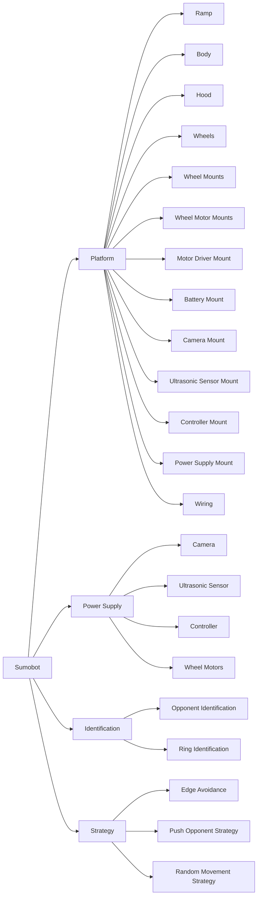

# Sumoltaneous Equations

## Problem Statement

Build a UGV to win the sumobot competition i.e. to win, it must be the last robot to overstep the boundary of the dohyo. It must also adhere to the rules and use the parts provided by UNSW Create.

## Requirements

- Maximise torque output from motors.
- Maximise friction between tyres and dohyo.
- Maximise mass.

## Work Breakdown Structure

