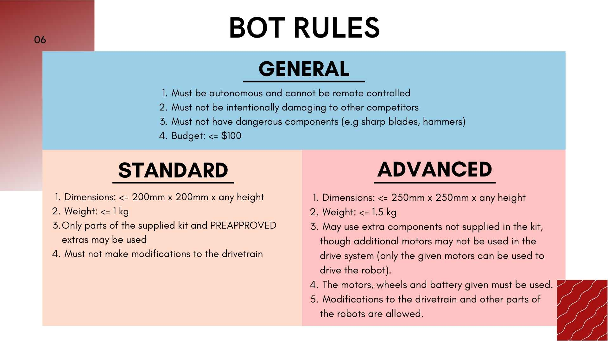

# Sumoltaneous Equations

## Rules

## Problem Statement

Build a UGV to win the sumobot competition i.e. to win, it must be the last robot to overstep the boundary of the dohyo. It must also adhere to the rules and use the parts provided by UNSW Create.

## Budget

| Name | Quantity | Price Per Item | Link |
| --- | --- | --- | --- |
| Wheel (65 OD) | 2 | 3 | https://store.createunsw.com.au/yellow-wheel-65-mm |
| MPU-6050 | 1| 8 | https://store.createunsw.com.au/gyroscope-accelerometer |

## Resources

- Japanese Sumobots Documentary: https://youtu.be/mS-L2fpV1Is
- Sumobot Strategies: https://youtu.be/rthMiqFCiBA
- SENAI-SC Sumo Robot Example: https://blog.jsumo.com/senai-sc-sumo-robot/.
- Impala Sumo Robot Example: https://blog.jsumo.com/impala-sumo-robot/.
- Arduino Nano Datasheet: https://Datasheet.arduino.cc/hardware/nano
- L298N Motor Controller Datasheet: https://components101.com/sites/default/files/component_datasheet/L298N-Motor-Driver-Datasheet.pdf
- HC-SR04 Ultrasonic Sensor Datasheet: https://www.digikey.com/htmldatasheets/production/1979760/0/0/1/hc-sr04.html
- MH-B IR Sensor Datasheet: https://components101.com/sites/default/files/component_datasheet/Datasheet%20of%20IR%20%20Sensor.pdf
- Turnigy 1250 mAh 3S 30C LiPo Battery: https://hobbyking.com/en_us/turnigy-1250mah-3s-30c-lipo-pack-long.html
- JGA25-370 DC Motor: https://www.aliexpress.com/item/1005001279982165.html
- JGA25-370 Bracket: https://www.alibaba.com/product-detail/JGA25-370-Fixed-Support-Gear-Motor_1600120808634.html
- Wheel: https://www.aliexpress.com/item/32870820813.html
