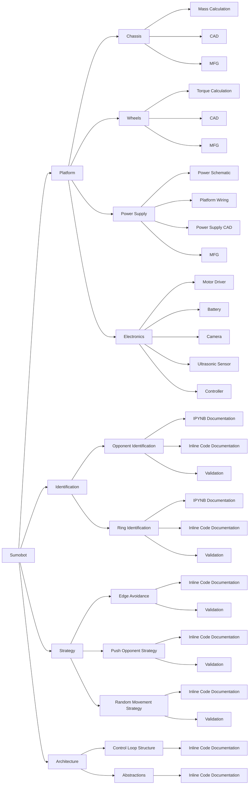

# Sumoltaneous Equations

## Problem Statement

Build a UGV to win the sumobot competition i.e. to win, it must be the last robot to overstep the boundary of the dohyo. It must also adhere to the rules and use the parts provided by UNSW Create.

## Requirements

- Maximise torque output from motors.
- Maximise friction between tyres and dohyo.
- Maximise mass.

## Work Breakdown Structure

WBS is extremely detailed because:
- Developing a sumobot already dictates a large number of high level decisions which allows the WBS to be defined at lower levels.
- Large project risk demands specific work packages due to experience level of team, conflicting individual commitments, and short project time frame.

