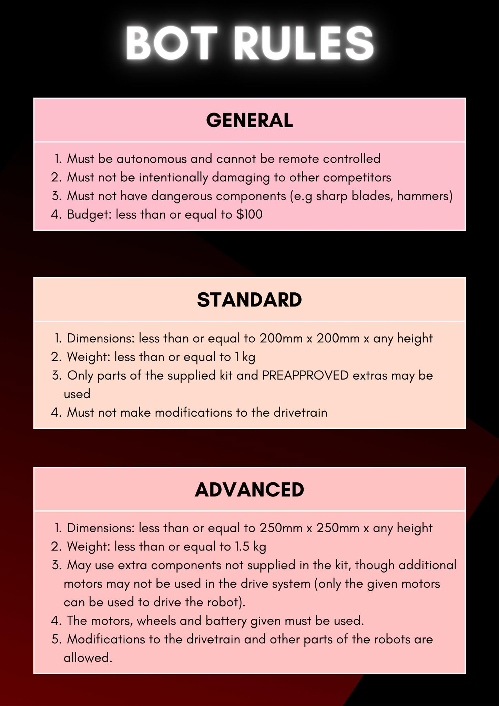

# Sumoltaneous Equations

## Rules

## Problem Statement

Build a UGV to win the sumobot competition i.e. to win, it must be the last robot to overstep the boundary of the dohyo. It must also adhere to the rules and use the parts provided by UNSW Create.

## Requirements

- Maximise torque output from motors.
- Maximise friction between tyres and dohyo.
- Maximise mass.
- Max base dimensions is 250 mm x 250 mm.
- Max weight is 1.5 kg.
- Must not use additional motors.
- Must use motors, wheels, and battery provided in the kit.

## Work Breakdown Structure

WBS is extremely detailed because:
- Developing a sumobot already dictates a large number of high level decisions which allows the WBS to be defined at lower levels.
- Large project risk demands specific work packages due to experience level of team, conflicting individual commitments, and short project time frame.

## Budget

## Resources

- Japanese Sumobots Documentary: https://youtu.be/mS-L2fpV1Is
- Sumobot Strategies: https://youtu.be/rthMiqFCiBA
- SENAI-SC Sumo Robot Example: https://blog.jsumo.com/senai-sc-sumo-robot/.
- Impala Sumo Robot Example: https://blog.jsumo.com/impala-sumo-robot/.
- Arduino Nano Datasheet: https://Datasheet.arduino.cc/hardware/nano
- L298N Motor Controller Datasheet: https://components101.com/sites/default/files/component_datasheet/L298N-Motor-Driver-Datasheet.pdf
- HC-SR04 Ultrasonic Sensor Datasheet: https://www.digikey.com/htmldatasheets/production/1979760/0/0/1/hc-sr04.html
- MH-B IR Sensor Datasheet: https://components101.com/sites/default/files/component_datasheet/Datasheet%20of%20IR%20%20Sensor.pdf
- Turnigy 1250 mAh 3S 30C LiPo Battery: https://hobbyking.com/en_us/turnigy-1250mah-3s-30c-lipo-pack-long.html
- JGA25-370 DC Motor: https://www.aliexpress.com/item/1005001279982165.html