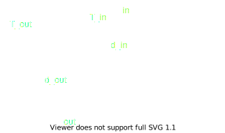

# Drive Model

## Motor

The motor model is [JGA25-370](https://ae01.alicdn.com/kf/H8264bb5cf6ff431a86f8ef713a801273X.jpg) rated at $6$ V and with a $46$ reduction ratio.

At no load, the motor is rated as:
$$
\begin{aligned}
    \omega_{\text{no load}} &= 130 \text{ RPM} \\
    i_{\text{no load}} &= 0.1 \text{ A}
\end{aligned}
$$

At load, the motor is rated as:
$$
\begin{aligned}
    \tau_{\text{load}} &= 100 \text{ kg/m} \\
    \omega_{\text{load}} &= 100 \text{ RPM} \\
    i_{\text{load}} &= 0.45 \text{ A}
\end{aligned}
$$

At stall, the motor is rated as:
$$
\begin{aligned}
    \tau_{\text{stall}} &= 360 \text{ kg/m} \\
    i_{\text{stall}} &= 1.8 \text{ A}
\end{aligned}
$$

> There is no need to calculate the motor constant because the motor is given to us.

## Gear Train

The gear ratio formula between the in and out gear is:
$$
\frac{\omega_{in}}{\omega_{out}} = \frac{n_{in}}{n_{out}} = \frac{d_{out}}{d_{in}} = \frac{\tau_{out}}{\tau_{in}}
$$

Given the dimensional constraints of the gears:
$$
\begin{aligned}
    d_{out} &= 60 \text{ mm} \\
    d_{in} &= 15 \text{ mm} \\
\end{aligned}
$$

With an input torque of $100$ kg/m, the output torque is:
$$
\begin{aligned}
    \frac{d_{out}}{d_{in}} &= \frac{\tau_{out}}{\tau_{in}} \\
    \frac{60}{15} &= \frac{\tau_{out}}{100} \\
    \therefore \tau_{out} &= 400 \text{ kg/m}
\end{aligned}
$$

## Control System

A control system is required to control the torque output of the motor. This is done through observing the supplied current.