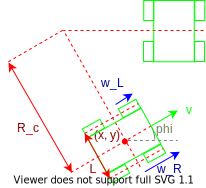

# Kinematic Model

The sumobot's state-space representation will let us localise the robot.

Let the state vector be:
$$
\vec{x}(t) = \left(\begin{matrix} x(t) \\ y(t) \\ \phi(t) \end{matrix}\right)
$$

The change in state over time is:
$$
\frac{d\vec{x}(t)}{dt} = \frac{d}{dt}\left(\begin{matrix} x(t) \\ y(t) \\ \phi(t) \end{matrix} \right)=
    \left(
        \begin{matrix}
            v(t) \cdot \cos\left(\phi(t)\right) \\
            v(t) \cdot \sin\left(\phi(t)\right) \\
            \omega(t) \\
        \end{matrix}
    \right)
$$

- $v$ is the linear velocity in x-y directions.
- $w$ is the angular velocity.

Let the input vector be:
$$
\vec{u}(t) = \left(\begin{matrix} \omega_{L}(t) \\ \omega_{R}(t) \end{matrix}\right)
$$

- $w_{L}$ is the angular veocity for each left wheel.
- $w_{R}$ is the angular veocity for each right wheel.

The left wheels are driven by a single left motor. The right wheels are driven by a single right motor. The kinematic model can be simplified to be a two-wheeled differential where the instantaneous centre of rotation is along the centre-line between the front and rear axes.

The linear velocity is:
$$
v(t) = \frac{R_{wheel}}{2}\left(\omega_{L}(t) + \omega_{R}(t)\right)
$$

The angular velocity is:
$$
\omega(t) = \frac{R_{wheel}}{2L}\left(\omega_{R}(t) - \omega_{L}(t) \right)
$$

The change in states over time is therefore:
$$
\frac{d\vec{x}(t)}{dt} =
    \left(
        \begin{matrix}
            \frac{R_{wheel}}{2}\left(\omega_{L}(t) + \omega_{R}(t)\right) \cdot \cos\left(\phi(t)\right) \\
            \frac{R_{wheel}}{2}\left(\omega_{L}(t) + \omega_{R}(t)\right) \cdot \sin\left(\phi(t)\right) \\
            \frac{R_{wheel}}{2L}\left(\omega_{R}(t) - \omega_{L}(t) \right) \\
        \end{matrix}
    \right)
$$

> Very important to recognise that the frame of reference is the centroid of the four wheels.