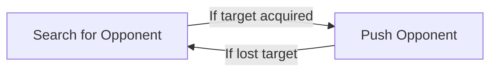

# Strategy

## Mapping

The map is a dohyo i.e. a ring with a black background and white edges.

We know the map will always be sparse. So sparse that it may not be worth the effort to even map it. We just have to make sure we don't risk reaching the edge of the dohyo.

We should only care about where the edge of the ring is and where we are relative to that (this should save A LOT of computation power). How do we do this?

We know:
- The diameter of the ring.
- Our starting position.

If we reach the edge of the dohyo, we can reset our state vector to be at some random point on the edge of the dohyo.

When we track our position, it will be some float coordinates.

## Search Patterns

When searching for the opponent, there are multiple patterns which can be employed:

### Radar

The sumobot just spins on the spot and searches for the opponent.

### Random Search

The sumobot randomly moves to a point on the dohyo and will end its search pattern when it identifies an opponent.

## Path Planning

We know:
- The diameter of the ring.
- Our position within the ring.
- And maybe our opponent's position within the ring too.

This is all the information we need to perform path planning.

There are a few path planning strategies:

### Search And Push (SAP)

An extremely simple strategy.

### Search And Push* (SAP*)

An improved strategy on SAP which considers localisation.

The path planning can be complex e.g.
- We may only want to push the opponent from the inside of the sumobot.
- We may only want to push the opponent from its side or behind and not head on.

The path planning algorithm could be implemented with:
- Queuing waypoints.

