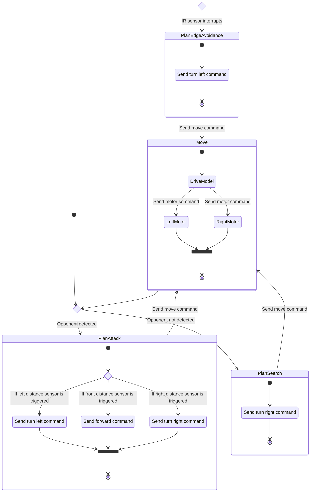

# Sumoltaneous Equations

## State Diagram

```mermaid
stateDiagram-v2
    state if_ir_sensor_interrupt <<choice>>
    state if_distance_sensor <<choice>>
    [*] --> if_distance_sensor

    if_ir_sensor_interrupt --> PlanEdgeAvoidance: IR sensor interrupts

    if_distance_sensor --> PlanAttack: Opponent detected
    if_distance_sensor --> PlanSearch: Opponent not detected

    state PlanSearch {
        [*] --> SearchTurnRight
        SearchTurnRight: Send turn right command
        SearchTurnRight --> [*]
    }

    state PlanAttack {
        state if_which_distance_sensor <<choice>>
        state join_attack_move <<join>>
        [*] --> if_which_distance_sensor
        if_which_distance_sensor --> TurnLeft: If left distance sensor is triggered
        TurnLeft: Send turn left command
        if_which_distance_sensor --> Forward: If front distance sensor is triggered
        Forward: Send forward command
        if_which_distance_sensor --> TurnRight: If right distance sensor is triggered
        TurnRight: Send turn right command
        TurnLeft --> join_attack_move
        Forward --> join_attack_move
        TurnRight --> join_attack_move
        join_attack_move --> [*]
    }

    state PlanEdgeAvoidance {
        [*] --> AvoidTurnLeft
        AvoidTurnLeft: Send turn left command
        AvoidTurnLeft --> [*]
    }

    PlanSearch --> Move: Send move command
    PlanAttack --> Move: Send move command
    PlanEdgeAvoidance --> Move: Send move command

    state Move {
        state join_after_move <<join>>
        [*] --> DriveModel
        DriveModel
        DriveModel --> LeftMotor: Send motor command
        DriveModel --> RightMotor: Send motor command
        LeftMotor --> join_after_move
        RightMotor --> join_after_move
        join_after_move --> [*]
    }

    Move --> if_distance_sensor
```

Move refers to moving the motors at max velocity. There are 3 moves that we can make:
- Turning left.
- Turning right.
- Moving forward.